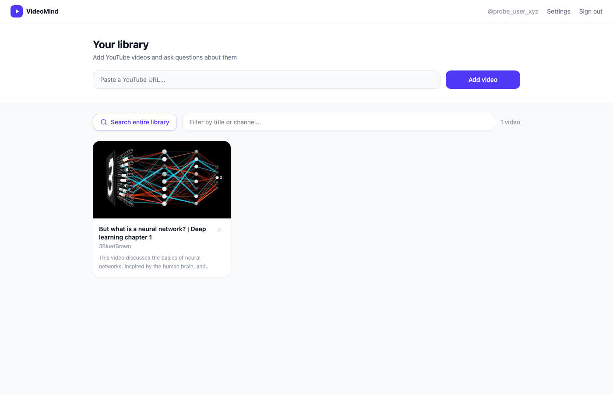
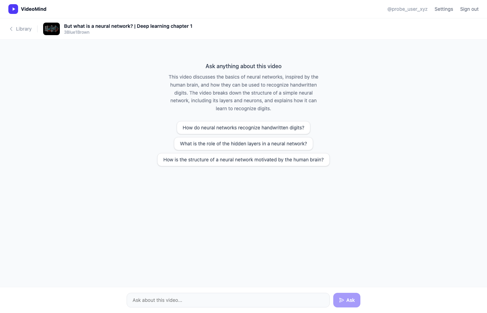
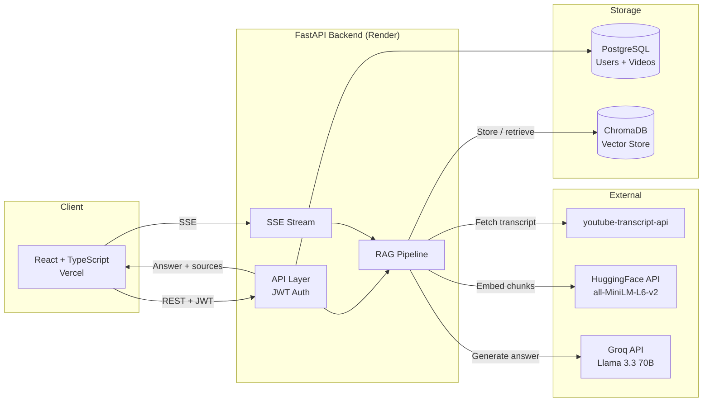

# VideoMind: YouTube Transcript RAG Assistant
Turn your YouTube watch history into a searchable knowledge base. Paste a video URL and VideoMind fetches the transcript, processes it, and lets you have a real conversation about it — with answers grounded in what was actually said.

**[Live Demo](https://youtube-rag-mu.vercel.app)**

---

## What It Does

Paste any YouTube URL. VideoMind fetches the transcript automatically, splits it into sentence-aware chunks, embeds them, and stores them in a vector database tied to your account.

Then ask anything. "What did this video say about gradient descent?" or "Which of my saved videos covers backpropagation?" The app finds the most semantically relevant segments across your library, passes them to an LLM, and streams the answer back token by token — with clickable timestamp links that jump to the exact moment in the video the answer came from.

Follow-up questions work too. The last 6 messages are passed as conversation history so the LLM understands context across a session.

I built this because I watch a lot of YouTube videos from creators I follow and could never remember which one covered what.

---

## Screenshots

| Library | Chat |
|---------|------|
|  |  |

---

## Architecture



Pipeline latency (production): ~120 ms for chunk retrieval (HuggingFace embedding call + ChromaDB cosine search); ~600 ms to first streamed token (Groq Llama 3.3 70B).

---

## How the RAG Pipeline Works

```
1. Ingest
   YouTube URL -> fetch transcript with timestamps (youtube-transcript-api)
              -> sentence-aware chunking (~300 words, ~50-word overlap, never mid-sentence)
              -> embed each chunk (HuggingFace all-MiniLM-L6-v2)
              -> store vectors in ChromaDB, metadata + timestamps in PostgreSQL
              -> generate 2-sentence summary + 3 suggested questions (Groq)

2. Query
   Question + chat history -> embed question in same vector space
                           -> hybrid BM25 + cosine retrieval with RRF fusion
                           -> distance threshold filters low-confidence results
                           -> top-5 most relevant chunks passed to Llama 3.3 70B
                           -> answer streamed token-by-token via SSE
                           -> source cards show video title, chunk preview, and timestamp link
```

Sentence-aware chunking means chunks never break mid-thought. The 50-word overlap means ideas that span chunk boundaries appear in both adjacent segments, so context is not lost at retrieval time.

---

## Retrieval Evaluation

```bash
python -m backend.eval.eval_harness --demo   # BM25 only, no API keys needed
python -m backend.eval.eval_harness --full   # BM25 + dense + hybrid (needs HF_TOKEN)
```

BM25 results on the included 18-question demo corpus (9 chunks spanning optimization, CNNs, transformers, and training techniques):

| Metric | BM25 |
|--------|------|
| Hit@1  | 0.67 |
| Hit@3  | 0.89 |
| Hit@5  | 1.00 |
| MRR    | 0.79 |

Run `--full` to compare BM25 vs. dense semantic vs. hybrid (BM25 + all-MiniLM-L6-v2 via RRF) on this corpus or against your own video library.

---

## Features

**Core**
- Add any YouTube video by URL — transcript is fetched and processed automatically
- Ask questions against a single video or your entire library
- Answers stream token by token rather than loading all at once
- Conversation memory — follow-up questions work because the last 6 messages are passed as context
- Source cards with "Watch at 2:34" timestamp links that jump to the exact moment in the video

**Library**
- Auto-generated 2-sentence summary and 3 suggested questions when a video is added
- Suggested questions appear as clickable chips in the chat empty state
- Search bar filters your library by video title or channel name
- Delete any video with the × button — removes both the PostgreSQL row and all ChromaDB vectors

**Reliability**
- On startup, VideoMind checks whether ChromaDB vectors exist for each stored video and re-embeds any that are missing — so a Render redeploy no longer wipes your library
- Proxy fallback — tries a rotating residential proxy first, falls back to a direct connection automatically if that fails

**Account**
- Username-based auth with clear error messages for invalid characters or duplicate usernames
- Settings page: change password (requires current password), delete account with a confirmation dialog that cascades through all vectors and rows cleanly

---

## Tech Stack

| Layer | Technology |
|-------|-----------|
| Frontend | React, TypeScript, Vite, Tailwind CSS, react-markdown |
| Backend | Python, FastAPI, SQLAlchemy |
| Database | PostgreSQL |
| Vector Store | ChromaDB (cosine similarity) |
| Embeddings | HuggingFace Inference API (`all-MiniLM-L6-v2`) |
| LLM | Groq API (Llama 3.3 70B Versatile) |
| Auth | JWT (python-jose) + bcrypt |
| Transcripts | youtube-transcript-api |
| Infrastructure | Docker, Render (backend), Vercel (frontend) |

---

## API Endpoints

| Method | Endpoint | Description | Auth |
|--------|----------|-------------|------|
| POST | `/auth/register` | Create account | No |
| POST | `/auth/login` | Login, returns JWT | No |
| POST | `/videos` | Add video by YouTube URL | Yes |
| GET | `/videos` | List your video library | Yes |
| DELETE | `/videos/{id}` | Delete video and all its vectors | Yes |
| POST | `/query` | Ask a question (single video or full library) | Yes |
| POST | `/query/stream` | Same as above, streamed via SSE | Yes |
| PUT | `/auth/password` | Change password | Yes |
| DELETE | `/auth/account` | Delete account and all data | Yes |

Full interactive docs available at `/docs` (Swagger UI).

---

## Project Structure

```
youtube-rag/
├── backend/
│   ├── main.py          # FastAPI app, all endpoints, CORS, auth middleware, startup re-embed hook
│   ├── database.py      # SQLAlchemy engine and session
│   ├── models.py        # User and Video ORM models (includes summary, suggested_questions, timestamps columns)
│   ├── auth.py          # JWT creation/verification, bcrypt hashing
│   ├── chunker.py       # Sentence-aware chunking with configurable overlap
│   ├── embedder.py      # HuggingFace Inference API client
│   ├── vector_store.py  # ChromaDB PersistentClient wrapper (add, delete, query, bulk fetch)
│   ├── retriever.py     # Hybrid BM25 + semantic search with RRF fusion and distance threshold
│   ├── generator.py     # Groq/Llama 3.3 70B, grounded generation with sources and chat history
│   ├── eval/
│   │   ├── eval_harness.py       # Retrieval eval: Hit@K and MRR on labelled QA pairs
│   │   └── sample_transcript.json  # Built-in ML/optimization transcript for offline evaluation
│   ├── tests/
│   │   └── test_main.py # pytest tests: register, login, duplicate username, invalid username, auth-protected routes
│   └── requirements.txt
├── frontend/
│   ├── src/
│   │   ├── pages/       # Login, Library, Chat, Settings
│   │   ├── components/  # Navbar
│   │   ├── context/     # AuthContext (JWT + username in localStorage)
│   │   └── api/         # Axios instance with JWT interceptor
│   └── vite.config.ts
└── Dockerfile
```

---

## Known Limitations

- Videos without auto-generated captions cannot be transcribed — uncommon for popular creators but does happen
- Hybrid BM25 + semantic retrieval (RRF fusion) and a distance threshold (default 0.8) are in place, but the optimal threshold will vary by domain; evaluate with `eval_harness.py --full` on your video library to calibrate
- ChromaDB vectors are stored in-container on Render's free tier. The startup re-embed hook handles redeployments automatically, but a persistent volume would be cleaner in production

---

*Built by [Shruthi Hariprasad](https://github.com/shruthi-hariprasad)*
