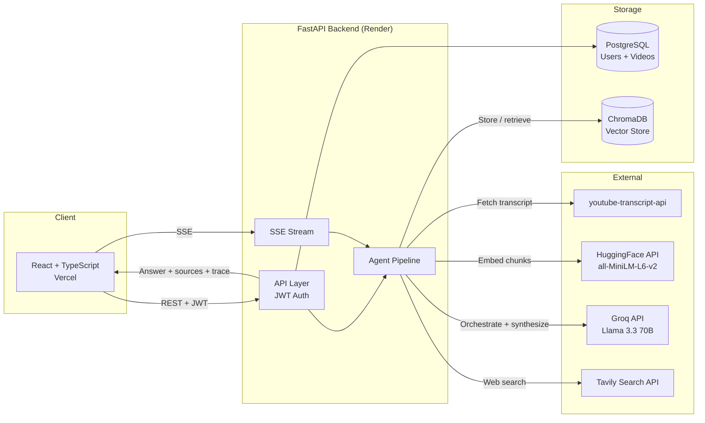

# VideoMind: YouTube Transcript RAG Assistant

Turn your YouTube watch history into a searchable knowledge base. Paste a video URL and VideoMind fetches the transcript, processes it, and lets you have a real conversation about it — with answers grounded in what was actually said.

**[Live Demo](https://youtube-rag-mu.vercel.app)**

---

## What It Does

Paste any YouTube URL. VideoMind fetches the transcript automatically, splits it into sentence-aware chunks, embeds them, and stores them in a vector database tied to your account.

Then ask anything. "What did this video say about gradient descent?" or "Which of my saved videos covers backpropagation?" An agent searches your video library and — when the question calls for it — the web, then synthesizes a final answer from both sources.

The answer streams back token by token with a collapsible reasoning trace showing which sources were checked, and timestamp links that jump to the exact moment in the video.

I built this because I watch a lot of YouTube videos from creators I follow and could never remember which one covered what.

---

## Screenshots

| Library | Chat |
|---------|------|
|  |  |

---

## Architecture



Pipeline latency (production): ~120 ms for chunk retrieval (HuggingFace embedding call + ChromaDB cosine search); ~600 ms to first streamed token (Groq Llama 3.3 70B).

---

## How the Agent Pipeline Works

```
Every question goes through a two-stage agentic flow:

1. Video search (always)
   Question -> hybrid BM25 + cosine retrieval with RRF fusion
            -> top-5 chunks from the user's video library

2. Web decision (LLM-driven)
   Video results -> Llama 3.3 70B decides: "is this enough to answer the question?"
                 -> if yes: skip web search
                 -> if no: generate a focused web query, run Tavily search

3. Re-rank
   All collected chunks (video + web) -> re-embed with original question
                                      -> sort by cosine similarity

4. Synthesize
   Top chunks -> Llama 3.3 70B streams final answer
              -> sources emitted as SSE event with video timestamps and web URLs

The reasoning trace (which sources were searched and what queries were used) is
streamed to the UI in real time as SSE events, so the user can see the agent's
decisions as they happen.
```

```
Ingest (async — returns 202 immediately, heavy work runs in background)
   YouTube URL -> fetch transcript with timestamps (youtube-transcript-api)
              -> video row saved to PostgreSQL immediately (202 returned)
              -> sentence-aware chunking (~300 words, ~50-word overlap, never mid-sentence)
              -> embed each chunk (HuggingFace all-MiniLM-L6-v2)
              -> store vectors in ChromaDB, metadata + timestamps in PostgreSQL
              -> generate 2-sentence summary + 3 suggested questions (Groq)
```

Sentence-aware chunking means chunks never break mid-thought. The 50-word overlap means ideas that span chunk boundaries appear in both adjacent segments, so context is not lost at retrieval time.

---

## Retrieval Evaluation

```bash
python -m backend.eval.eval_harness --demo   # BM25 only, no API keys needed
python -m backend.eval.eval_harness --full   # BM25 + dense + hybrid (needs HF_TOKEN)
```

BM25 results on the included 18-question demo corpus (9 chunks spanning optimization, CNNs, transformers, and training techniques):

| Metric | BM25 |
|--------|------|
| Hit@1  | 0.67 |
| Hit@3  | 0.89 |
| Hit@5  | 1.00 |
| MRR    | 0.79 |

Run `--full` to compare BM25 vs. dense semantic vs. hybrid (BM25 + all-MiniLM-L6-v2 via RRF) on this corpus or against your own video library.

---

## Features

**Agent**
- Every question first searches your video library, then an LLM decides whether web search is needed — not a fixed rule, but a reasoned decision based on what the video results actually contain
- Reasoning trace streams in real time: which tool was called, what query was used, how many results came back
- All sources (video chunks + web results) are re-ranked by cosine similarity to the original question before synthesis
- Web search degrades gracefully — if Tavily is unavailable, the agent falls back to video-only

**Core**
- Add any YouTube video by URL — transcript is fetched and the video is saved immediately; embedding and summary generation run in the background
- Ask questions against a single video or your entire library
- Answers stream token by token rather than loading all at once
- Conversation memory — follow-up questions work because the last 6 messages are passed as context
- Source cards with timestamp links that jump to the exact moment in the video; web sources show title and URL

**Library**
- Auto-generated 2-sentence summary and 3 suggested questions when a video is added
- Suggested questions appear as clickable chips in the chat empty state
- Search bar filters your library by video title or channel name
- Delete any video with the × button — removes both the PostgreSQL row and all ChromaDB vectors

**Reliability**
- Schema managed with Alembic — migrations run explicitly (`alembic upgrade head`) rather than on every startup, so schema changes are tracked, reversible, and safe to run in production
- On startup, VideoMind checks whether ChromaDB vectors exist for each stored video and re-embeds any that are missing — so a Render redeploy no longer wipes your library
- Proxy fallback — tries a rotating residential proxy first, falls back to a direct connection automatically if that fails

**Account**
- Username-based auth with clear error messages for invalid characters or duplicate usernames
- Settings page: change password (requires current password), delete account with a confirmation dialog that cascades through all vectors and rows cleanly

---

## Tech Stack

| Layer | Technology |
|-------|-----------|
| Frontend | React, TypeScript, Vite, Tailwind CSS, react-markdown |
| Backend | Python, FastAPI, SQLAlchemy |
| Database | PostgreSQL |
| Vector Store | ChromaDB (cosine similarity) |
| Embeddings | HuggingFace Inference API (`all-MiniLM-L6-v2`) |
| LLM | Groq API (Llama 3.3 70B Versatile) |
| Web Search | Tavily Search API |
| Auth | JWT (python-jose) + bcrypt |
| Transcripts | youtube-transcript-api |
| Infrastructure | Docker, Render (backend), Vercel (frontend) |

---

## API Endpoints

| Method | Endpoint | Description | Auth |
|--------|----------|-------------|------|
| POST | `/auth/register` | Create account | No |
| POST | `/auth/login` | Login, returns JWT | No |
| POST | `/videos` | Add video by URL — returns `202` immediately; embedding and summary run in background | Yes |
| GET | `/videos` | List your video library | Yes |
| DELETE | `/videos/{id}` | Delete video and all its vectors | Yes |
| POST | `/query` | Ask a question (non-streaming) | Yes |
| POST | `/query/stream` | Ask a question, streamed via SSE | Yes |
| POST | `/query/agent` | Agentic query — searches videos, decides on web search, streams reasoning trace + answer via SSE | Yes |
| PUT | `/auth/password` | Change password | Yes |
| DELETE | `/auth/account` | Delete account and all data | Yes |

Full interactive docs available at `/docs` (Swagger UI).

---

## Project Structure

```
youtube-rag/
├── alembic.ini
├── backend/
│   ├── alembic/
│   │   ├── env.py                  # Alembic env wired to SQLAlchemy models + DATABASE_URL
│   │   └── versions/
│   │       ├── 0001_initial_schema.py                      # Baseline tables
│   │       └── 0002_add_transcript_and_summary_columns.py  # transcript_segments, summary, suggested_questions
│   ├── main.py          # FastAPI app, endpoints, CORS, auth middleware, background ingestion
│   ├── database.py      # SQLAlchemy engine and session
│   ├── models.py        # User and Video ORM models
│   ├── auth.py          # JWT creation/verification, bcrypt hashing
│   ├── chunker.py       # Sentence-aware chunking with configurable overlap
│   ├── embedder.py      # HuggingFace Inference API client
│   ├── vector_store.py  # ChromaDB PersistentClient wrapper (add, delete, query, bulk fetch)
│   ├── retriever.py     # Hybrid BM25 + semantic search with RRF fusion and distance threshold
│   ├── generator.py     # Groq/Llama 3.3 70B, grounded generation with sources and chat history
│   ├── agent.py         # Agentic pipeline: video search → LLM web decision → re-rank → synthesize
│   ├── web_search.py    # Tavily Search API wrapper with graceful fallback
│   ├── eval/
│   │   ├── eval_harness.py         # Retrieval eval: Hit@K and MRR on labelled QA pairs
│   │   └── sample_transcript.json  # Built-in ML/optimization transcript for offline evaluation
│   ├── tests/
│   │   └── test_main.py # pytest: auth flows, video add/delete, query end-to-end (mocked external calls)
│   └── requirements.txt
├── frontend/
│   ├── src/
│   │   ├── pages/       # Login, Library, Chat, Settings
│   │   ├── components/  # Navbar
│   │   ├── context/     # AuthContext (JWT + username in localStorage)
│   │   └── api/         # Axios instance with JWT interceptor
│   └── vite.config.ts
└── Dockerfile
```

---

## Environment Variables

| Variable | Required | Description |
|----------|----------|-------------|
| `DATABASE_URL` | Yes | PostgreSQL connection string |
| `SECRET_KEY` | Yes | JWT signing secret |
| `GROQ_API_KEY` | Yes | Groq API key (Llama 3.3 70B) |
| `HF_TOKEN` | Yes | HuggingFace token (embeddings) |
| `TAVILY_API_KEY` | No | Tavily Search API key — web search is skipped if not set |
| `WEBSHARE_PROXY_USERNAME` | No | Proxy credentials for transcript fetching |
| `WEBSHARE_PROXY_PASSWORD` | No | Proxy credentials for transcript fetching |

---

## Deployment note

Before starting the backend for the first time (or after pulling schema changes), run:

```bash
alembic upgrade head
```

The app no longer runs migrations on startup — they are explicit and tracked via Alembic.

---

## Known Limitations

- Videos without auto-generated captions cannot be transcribed — uncommon for popular creators but does happen
- Hybrid BM25 + semantic retrieval (RRF fusion) and a distance threshold (default 0.8) are in place, but the optimal threshold will vary by domain; evaluate with `eval_harness.py --full` on your video library to calibrate
- ChromaDB vectors are stored in-container on Render's free tier. The startup re-embed hook handles redeployments automatically, but a persistent volume would be cleaner in production
- Tavily free tier allows 1,000 web searches/month — sufficient for personal use and demos

---

*Built by [Shruthi Hariprasad](https://github.com/shruthi-hariprasad)*
