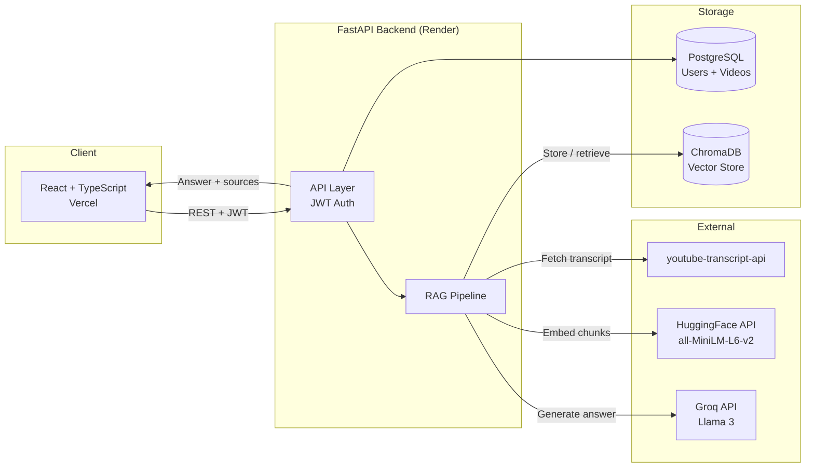

# VideoMind: YouTube Transcript RAG Assistant

Turn your YouTube watch history into a searchable knowledge base. Paste a video URL and VideoMind automatically ingests the transcript, then ask anything across your entire library and get answers grounded in what was actually said.

**[Live Demo](https://youtube-rag-mu.vercel.app)**

---

## What It Does

Paste any YouTube URL. VideoMind fetches the transcript automatically with no manual downloading or file uploads. The transcript gets chunked, embedded, and stored in a vector database tied to your account.

Then ask anything. "What did this video say about gradient descent?" or "Which of my saved videos covers backpropagation?" The app finds the most semantically relevant segments across your library and passes them to an LLM to generate an answer grounded in the actual transcript content.

I built this because I watch a lot of YouTube videos from creators I follow and could never remember which one covered what.

---

## Architecture



---

## How the RAG Pipeline Works

```
1. Ingest
   YouTube URL -> fetch transcript (youtube-transcript-api)
              -> chunk into 300-word segments with 50-word overlap
              -> embed each chunk (HuggingFace all-MiniLM-L6-v2)
              -> store vectors in ChromaDB, metadata in PostgreSQL

2. Query
   Question -> embed in same vector space
            -> cosine similarity search across your video library
            -> top-5 most relevant chunks retrieved
            -> passed to Llama 3 (Groq) with grounding instruction
            -> answer returned with source attribution (video title + chunk)
```

The 50-word overlap means ideas that span chunk boundaries show up in both adjacent segments, so context isn't lost at retrieval time.

---

## Tech Stack

| Layer | Technology |
|-------|-----------|
| Frontend | React, TypeScript, Vite, Tailwind CSS |
| Backend | Python, FastAPI, SQLAlchemy |
| Database | PostgreSQL |
| Vector Store | ChromaDB (cosine similarity) |
| Embeddings | HuggingFace Inference API (`all-MiniLM-L6-v2`) |
| LLM | Groq API (Llama 3) |
| Auth | JWT (python-jose) + bcrypt |
| Transcripts | youtube-transcript-api |
| Infrastructure | Docker, Render (backend), Vercel (frontend) |

---

## API Endpoints

| Method | Endpoint | Description | Auth |
|--------|----------|-------------|------|
| POST | `/auth/register` | Create account | No |
| POST | `/auth/login` | Login, returns JWT | No |
| POST | `/videos` | Add video by YouTube URL | Yes |
| GET | `/videos` | List your video library | Yes |
| POST | `/query` | Ask a question (single video or full library) | Yes |

Full interactive docs available at `/docs` (Swagger UI).

---

## Run Locally

### Prerequisites
- Python 3.11+
- PostgreSQL
- Node.js 18+
- API keys: `HF_TOKEN` (HuggingFace) and `GROQ_API_KEY` (Groq)

### Backend

```bash
git clone https://github.com/shruthi-hariprasad/youtube-rag.git
cd youtube-rag/backend

python3 -m venv venv
source venv/bin/activate
pip install -r requirements.txt

cp .env.example .env
# Fill in: DATABASE_URL, SECRET_KEY, HF_TOKEN, GROQ_API_KEY

createdb youtube_rag
cd ..
uvicorn backend.main:app --reload
```

### Frontend

```bash
cd frontend
npm install
npm run dev
```

Set `VITE_API_URL=http://localhost:8000` in `frontend/.env`.

### Docker

```bash
docker build -t youtube-rag-backend .
docker run -p 8000:8000 --env-file backend/.env youtube-rag-backend
```

---

## Project Structure

```
youtube-rag/
├── backend/
│   ├── main.py          # FastAPI app, 5 endpoints, CORS, auth middleware
│   ├── database.py      # SQLAlchemy engine and session
│   ├── models.py        # User and Video ORM models
│   ├── auth.py          # JWT creation/verification, bcrypt hashing
│   ├── chunker.py       # Word-based chunking with configurable overlap
│   ├── embedder.py      # HuggingFace Inference API client
│   ├── vector_store.py  # ChromaDB PersistentClient wrapper
│   ├── retriever.py     # Semantic search with optional video_id filter
│   ├── generator.py     # Groq/Llama 3, grounded generation with sources
│   ├── tests/
│   │   └── test_main.py # 8 pytest tests covering auth flows and edge cases
│   └── requirements.txt
├── frontend/
│   ├── src/
│   │   ├── pages/       # Login, Library, Chat
│   │   ├── components/  # Navbar
│   │   ├── context/     # AuthContext (JWT)
│   │   └── api/         # Axios instance with JWT interceptor
│   └── vite.config.ts
└── Dockerfile
```

---

## Known Limitations

- Videos without auto-generated captions cannot be transcribed (uncommon for popular creators)
- Dense retrieval can struggle when query vocabulary is very different from transcript vocabulary, a known limitation of this approach addressable with hybrid search (BM25 + semantic) or query rewriting
- ChromaDB vectors are stored in-container on Render's free tier, so data persists between requests but resets on redeploy (fine for demo purposes; a persistent volume would be used in production)

---

*Built by [Shruthi Hariprasad](https://github.com/shruthi-hariprasad) — MS CS, UMass Amherst*
