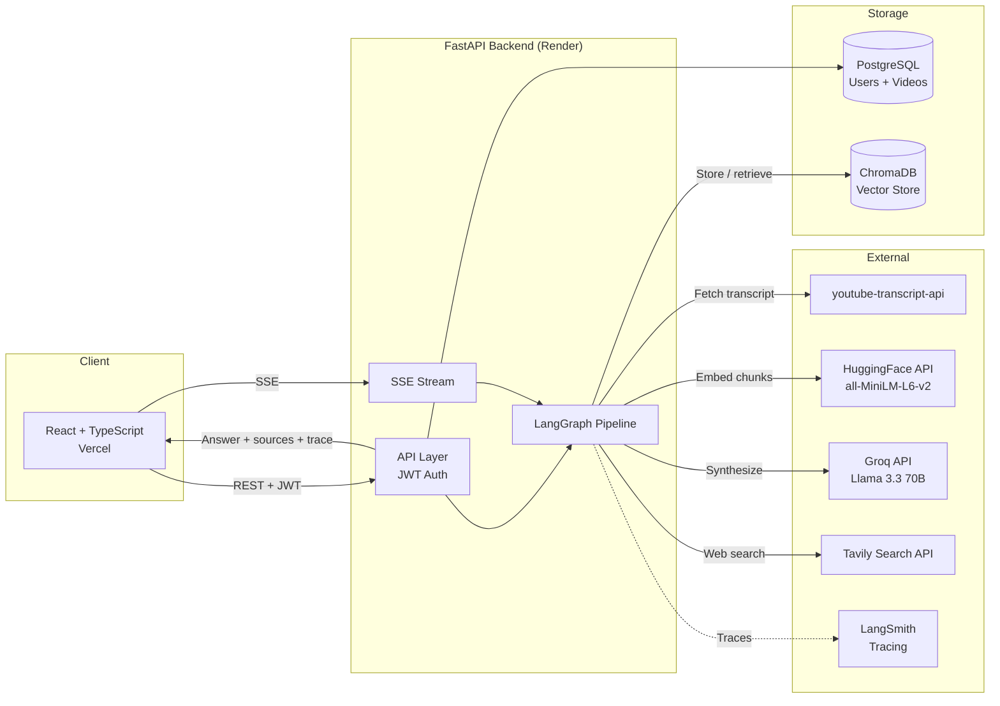

# VideoMind: YouTube Transcript RAG Assistant

Turn your YouTube watch history into a searchable knowledge base. Paste a video URL and VideoMind fetches the transcript, processes it, and lets you have a real conversation about it — with answers grounded in what was actually said.

**[Live Demo](https://youtube-rag-mu.vercel.app)**

---

## What It Does

Paste any YouTube URL. VideoMind fetches the transcript automatically, splits it into sentence-aware chunks, embeds them, and stores them in a vector database tied to your account.

Then ask anything — about a single video or across your entire library. An agentic retrieval pipeline searches your videos and, when the question calls for it, the web, then synthesizes a grounded answer from both sources. Answers stream token by token with a collapsible reasoning trace and timestamp links that jump to the exact moment in the video.

I built this because I watch a lot of YouTube videos from creators I follow and could never remember which one covered what.

---

## Screenshots

| Library | Chat |
|---------|------|
|  |  |

---

## Architecture



---

## How the Pipeline Works

The agent is implemented as a **LangGraph state graph** — each stage is a discrete node with typed inputs and outputs. SSE events stream to the frontend as each node completes.

```
query_rewrite_node → retrieve_node → web_decision_node → [web_search_node →] merge_chunks_node
                                                                    ↕ conditional
                                                          synthesize (streaming, outside graph)
```

**Node by node:**

```
0. query_rewrite_node
   Follow-up question + history → Llama 3.1 8B rewrites into self-contained search query
   e.g. "what about boulder 4?" → "Colin Duffy boulder 4 performance Bern 2026"

1. retrieve_node
   Query → hybrid BM25 + cosine retrieval with RRF fusion
         → top-8 chunks from the user's video library
         → metadata chunk (title, channel, URL, summary) injected for each
            video that appears in results

2. web_decision_node (Llama 3.1 8B — cheap, separate quota)
   Video results → is this enough to answer the question?
                → if yes: skip web search
                → if no: generate focused web query

3. web_search_node (conditional)
   Focused query → Tavily search → web chunks merged into context

4. merge_chunks_node
   Deduplicate + rank all chunks, assign relevance scores

5. Synthesize (Llama 3.3 70B — streaming, bypasses graph for per-token latency)
   Top-10 chunks (video + web) → streams final answer token by token
```

```
Ingest (async — 202 returned immediately, heavy work runs in background)
   YouTube URL → fetch transcript with timestamps
              → sentence-aware chunking (~300 words, ~50-word overlap)
              → embed chunks (HuggingFace all-MiniLM-L6-v2)
              → store vectors in ChromaDB with timestamps
              → generate summary + 3 suggested questions (Groq)
```

Every pipeline run is traced end-to-end in **LangSmith** — node latencies, inputs/outputs, and token counts are visible in the dashboard.

---

## Retrieval Evaluation

The eval harness lives in `backend/eval/`. It measures both retrieval quality (Hit@K, MRR) and generation quality (faithfulness, answer relevancy, context recall via RAGAS).

### Retrieval: BM25 vs Dense vs Hybrid

Evaluated on a 76-question corpus across 4 diverse video types (unboxing, dating show, social experiment, sports commentary):

| Method | Hit@1 | Hit@3 | Hit@5 | MRR |
|--------|-------|-------|-------|-----|
| BM25 | 0.776 | 0.803 | 0.829 | 0.799 |
| Dense (all-MiniLM-L6-v2) | 0.711 | 0.803 | 0.803 | 0.757 |
| **Hybrid BM25 + Dense (RRF)** | **0.711** | **0.789** | **0.816** | **0.756** |

BM25 leads on this corpus because the video content is conversational and contains many proper nouns (names, brands, places) that exact-match retrieval handles well. Hybrid RRF closes the gap at higher K by catching cases where semantic similarity surfaces relevant chunks that keyword matching misses.

### Generation: RAGAS Scores

*To be updated after eval run — run `pytest backend/eval/test_ragas_eval.py -m "eval and full" -v` to generate.*

| Metric | Score | Threshold |
|--------|-------|-----------|
| Faithfulness | — | ≥ 0.70 |
| Answer Relevancy | — | ≥ 0.65 |
| Context Recall | — | ≥ 0.55 |

### Failure Analysis

The hardest cases for this pipeline:

1. **Noisy ASR transcripts** — the dating show video (`mbd2NdZ4Cl4`) has poor speech recognition quality, producing fragments like "Love a pop. Heat. Heat." Chunking these produces low-signal context that hurts both retrieval and faithfulness scores.

2. **Questions without timestamp segments** — three of four eval videos have no segment timestamps, so retrieved chunks can't be pinpointed to an exact moment. The source UI shows the chunk text but no jump-to link.

3. **Cross-video questions** — "which video mentions X?" requires the model to reason across multiple retrieved chunks from different videos. The metadata chunk injection helps, but the synthesizer occasionally conflates video sources.

4. **Out-of-scope follow-ups** — very short follow-up questions like "why?" with minimal history context sometimes produce search queries that are too vague, retrieving low-relevance chunks before the web decision fires.

### Running the Eval

```bash
# Install eval dependencies (not needed in production)
pip install -r requirements-eval.txt

# Retrieval comparison table — no Groq quota needed
pytest backend/eval/test_ragas_eval.py::test_retrieval_comparison -v -s

# Quick RAGAS smoke test (8 samples, ~2 min)
pytest backend/eval/test_ragas_eval.py::test_ragas_smoke -v -s

# Full 76-question RAGAS eval (~20 min, saves eval_results.json)
pytest backend/eval/test_ragas_eval.py::test_ragas_full -v -s
```

---

## MCP Tool Endpoint

The retrieval pipeline is exposed as a **Model Context Protocol (MCP)** server at `POST /mcp`, allowing any MCP-compatible client (Claude Desktop, Cursor) to search your video library as a tool.

```bash
# List available tools
curl -X POST https://youtube-rag-backend-4gox.onrender.com/mcp \
  -H "Content-Type: application/json" \
  -d '{"jsonrpc":"2.0","id":1,"method":"tools/list","params":{}}'

# Search the video library
curl -X POST https://youtube-rag-backend-4gox.onrender.com/mcp \
  -H "Content-Type: application/json" \
  -d '{"jsonrpc":"2.0","id":2,"method":"tools/call","params":{"name":"search_video_library","arguments":{"query":"boulder final results","n_results":3}}}'
```

**Tool: `search_video_library`**
- `query` (required) — search query
- `video_ids` (optional) — restrict to specific YouTube video IDs
- `n_results` (optional, default 5, max 20) — number of chunks to return

Returns ranked transcript chunks with `video_id`, `text`, `start_time`, and `rrf_score`.

---

## Features

**Pipeline**
- LangGraph state graph — each pipeline stage is a typed node with observable inputs/outputs
- LangSmith tracing — every run traced end-to-end; node latencies and token counts in dashboard
- MCP server endpoint — `search_video_library` tool exposed via JSON-RPC 2.0
- Follow-up questions rewritten into self-contained queries using conversation history
- Metadata chunks (title, channel, URL, summary) injected only for videos that appear in results
- Web decision model sees all retrieved chunks before deciding — skips search when video has the answer
- Up to 3 timestamp sources per video in retrieval-rank order with text excerpt

**Core**
- Add any YouTube video by URL — transcript fetched immediately, embedding and summary run in the background
- Ask questions against a single video or your entire library
- Answers stream token by token
- Chat history persists across page refreshes
- Clear chat button in the input bar

**Library**
- Auto-generated summary and 3 suggested questions per video
- Suggested questions appear as clickable chips in the chat empty state
- Search bar filters by title or channel name
- Delete any video — removes both the database row and all ChromaDB vectors

**Reliability**
- On startup, re-embeds any videos whose vectors are missing — a Render redeploy does not wipe your library
- Proxy fallback for transcript fetching — tries residential proxy first, falls back to direct connection
- JSON retry on malformed LLM output — auto-recovers from occasional bad responses
- SSE fetch cancelled cleanly on navigation (AbortController)
- Agent errors surface as readable messages rather than silent failures

**Account**
- Username-based auth with JWT
- Change password, delete account (cascades through all vectors and rows)

---

## Tech Stack

| Layer | Technology |
|-------|-----------|
| Frontend | React, TypeScript, Vite, Tailwind CSS |
| Backend | Python, FastAPI, SQLAlchemy |
| Agent Framework | LangGraph |
| Observability | LangSmith |
| Database | PostgreSQL |
| Vector Store | ChromaDB |
| Embeddings | HuggingFace Inference API (`all-MiniLM-L6-v2`) |
| LLM | Groq API (Llama 3.3 70B synthesis, Llama 3.1 8B for lightweight calls) |
| Web Search | Tavily Search API |
| Eval | RAGAS, DeepEval, pytest |
| Auth | JWT + bcrypt |
| Transcripts | youtube-transcript-api |
| Infrastructure | Docker, Render (backend), Vercel (frontend) |

---

## API Endpoints

| Method | Endpoint | Description | Auth |
|--------|----------|-------------|------|
| POST | `/auth/register` | Create account | No |
| POST | `/auth/login` | Login, returns JWT | No |
| POST | `/videos` | Add video by URL — 202 immediately, ingestion in background | Yes |
| GET | `/videos` | List your video library | Yes |
| DELETE | `/videos/{id}` | Delete video and all its vectors | Yes |
| POST | `/query/agent` | LangGraph pipeline — streamed via SSE | Yes |
| POST | `/mcp` | MCP tool server — JSON-RPC 2.0 | No |
| PUT | `/auth/password` | Change password | Yes |
| DELETE | `/auth/account` | Delete account and all data | Yes |

Full interactive docs at `/docs`.

---

## Environment Variables

| Variable | Required | Description |
|----------|----------|-------------|
| `DATABASE_URL` | Yes | PostgreSQL connection string |
| `SECRET_KEY` | Yes | JWT signing secret |
| `GROQ_API_KEY` | Yes | Groq API key |
| `HF_TOKEN` | Yes | HuggingFace token (embeddings) |
| `TAVILY_API_KEY` | No | Web search — skipped if not set |
| `LANGCHAIN_TRACING_V2` | No | Set to `true` to enable LangSmith tracing |
| `LANGCHAIN_API_KEY` | No | LangSmith API key |
| `LANGCHAIN_PROJECT` | No | LangSmith project name (default: `youtube-rag`) |
| `WEBSHARE_PROXY_USERNAME` | No | Proxy for transcript fetching |
| `WEBSHARE_PROXY_PASSWORD` | No | Proxy for transcript fetching |

---

## Deployment

Before first run (or after schema changes):

```bash
alembic upgrade head
```

---

## Known Limitations

- Videos without auto-generated captions cannot be transcribed
- YouTube blocks transcript requests from cloud IPs; a residential proxy (Webshare) works around this
- ChromaDB vectors are stored in-container on Render's free tier; the startup re-embed hook handles redeployments
- Groq free tier: 100k tokens/day for 70B, 500k/day for 8B
- Tavily free tier: 1,000 web searches/month

---

*Built by [Shruthi Hariprasad](https://github.com/shruthi-hariprasad)*
