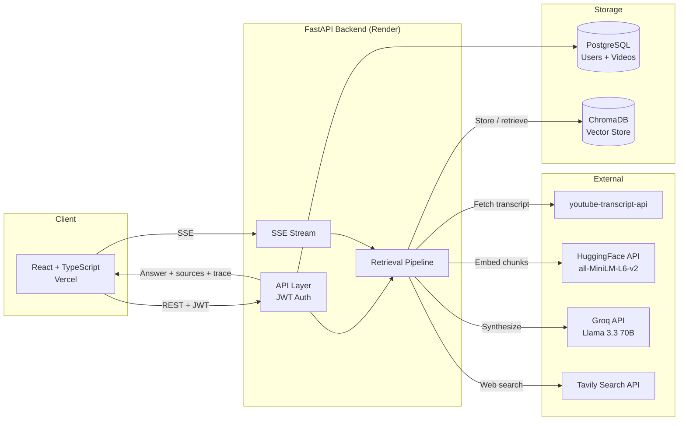

# VideoMind: YouTube Transcript RAG Assistant

Turn your YouTube watch history into a searchable knowledge base. Paste a video URL and VideoMind fetches the transcript, processes it, and lets you have a real conversation about it — with answers grounded in what was actually said.

**[Live Demo](https://youtube-rag-mu.vercel.app)**

---

## What It Does

Paste any YouTube URL. VideoMind fetches the transcript automatically, splits it into sentence-aware chunks, embeds them, and stores them in a vector database tied to your account.

Then ask anything — about a single video or across your entire library. A retrieval pipeline searches your videos and, when the question calls for it, the web, then synthesizes a grounded answer from both sources. Answers stream token by token with a collapsible reasoning trace and timestamp links that jump to the exact moment in the video.

I built this because I watch a lot of YouTube videos from creators I follow and could never remember which one covered what.

---

## Screenshots

| Library | Chat |
|---------|------|
|  |  |

---

## Architecture



---

## How the Pipeline Works

```
Every question goes through a structured flow:

0. Query rewrite (when conversation history exists)
   Follow-up question + history -> Llama 3.1 8B rewrites into self-contained search query
   e.g. "what about boulder 4?" -> "Colin Duffy boulder 4 performance Madrid 2026"

1. Video search (always)
   Query -> hybrid BM25 + cosine retrieval with RRF fusion
          -> top-8 chunks from the user's video library
          -> metadata chunk (title, channel, URL, summary) injected for each
             video that appears in results

2. Web decision (Llama 3.1 8B — cheap, separate quota)
   Video results -> is this enough to answer the question?
                 -> if yes: skip web search
                 -> if no: generate a focused web query, run Tavily search

3. Synthesize (Llama 3.3 70B)
   Top-10 chunks (video + web) -> streams final answer
   Sources: up to 3 timestamps per video in retrieval-rank order,
            with excerpt so the user can identify the right moment
```

```
Ingest (async — 202 returned immediately, heavy work runs in background)
   YouTube URL -> fetch transcript with timestamps
              -> sentence-aware chunking (~300 words, ~50-word overlap)
              -> embed chunks (HuggingFace all-MiniLM-L6-v2)
              -> store vectors in ChromaDB with timestamps
              -> generate summary (sampled from start + middle + end of transcript)
                 + 3 suggested questions (Groq)
```

---

## Retrieval Evaluation

```bash
python -m backend.eval.eval_harness --demo   # BM25 only, no API keys needed
python -m backend.eval.eval_harness --full   # BM25 + dense + hybrid (needs HF_TOKEN)
```

BM25 results on the included 18-question demo corpus:

| Metric | BM25 |
|--------|------|
| Hit@1  | 0.67 |
| Hit@3  | 0.89 |
| Hit@5  | 1.00 |
| MRR    | 0.79 |

---

## Features

**Pipeline**
- Follow-up questions rewritten into self-contained queries using conversation history before retrieval — short questions like "what about him?" find the right chunks
- Metadata chunks (title, channel, URL, summary) injected only for videos that appear in retrieved results, so they don't crowd out transcript content
- Web decision model sees all retrieved chunks before deciding — triggers on out-of-scope questions, skips when the video has the answer
- Up to 3 timestamp sources per video in retrieval-rank order, each with a text excerpt so the user can identify the right moment to jump to
- Reasoning trace streams in real time: tool called, query used, result count

**Core**
- Add any YouTube video by URL — transcript fetched immediately, embedding and summary run in the background
- Ask questions against a single video or your entire library
- Answers stream token by token
- Chat history persists across page refreshes
- Clear chat button in the input bar

**Library**
- Auto-generated summary (sampled across full transcript) and 3 suggested questions per video
- Suggested questions appear as clickable chips in the chat empty state
- Search bar filters by title or channel name
- Delete any video — removes both the database row and all ChromaDB vectors

**Reliability**
- On startup, re-embeds any videos whose vectors are missing — a Render redeploy does not wipe your library
- Proxy fallback for transcript fetching — tries residential proxy first, falls back to direct connection
- SSE fetch cancelled cleanly on navigation (AbortController)
- Agent errors surface as readable messages rather than silent failures

**Account**
- Username-based auth with JWT
- Change password, delete account (cascades through all vectors and rows)

---

## Tech Stack

| Layer | Technology |
|-------|-----------|
| Frontend | React, TypeScript, Vite, Tailwind CSS |
| Backend | Python, FastAPI, SQLAlchemy |
| Database | PostgreSQL |
| Vector Store | ChromaDB |
| Embeddings | HuggingFace Inference API (`all-MiniLM-L6-v2`) |
| LLM | Groq API (Llama 3.3 70B synthesis, Llama 3.1 8B for lightweight calls) |
| Web Search | Tavily Search API |
| Auth | JWT + bcrypt |
| Transcripts | youtube-transcript-api |
| Infrastructure | Docker, Render (backend), Vercel (frontend) |

---

## API Endpoints

| Method | Endpoint | Description | Auth |
|--------|----------|-------------|------|
| POST | `/auth/register` | Create account | No |
| POST | `/auth/login` | Login, returns JWT | No |
| POST | `/videos` | Add video by URL — 202 immediately, ingestion runs in background | Yes |
| GET | `/videos` | List your video library | Yes |
| DELETE | `/videos/{id}` | Delete video and all its vectors | Yes |
| POST | `/query/agent` | Retrieval pipeline — query rewrite → video search → web decision → synthesize, streamed via SSE | Yes |
| PUT | `/auth/password` | Change password | Yes |
| DELETE | `/auth/account` | Delete account and all data | Yes |

Full interactive docs at `/docs`.

---

## Environment Variables

| Variable | Required | Description |
|----------|----------|-------------|
| `DATABASE_URL` | Yes | PostgreSQL connection string |
| `SECRET_KEY` | Yes | JWT signing secret |
| `GROQ_API_KEY` | Yes | Groq API key |
| `HF_TOKEN` | Yes | HuggingFace token (embeddings) |
| `TAVILY_API_KEY` | No | Web search — skipped if not set |
| `WEBSHARE_PROXY_USERNAME` | No | Proxy for transcript fetching |
| `WEBSHARE_PROXY_PASSWORD` | No | Proxy for transcript fetching |

---

## Deployment

Before first run (or after schema changes):

```bash
alembic upgrade head
```

---

## Known Limitations

- Videos without auto-generated captions cannot be transcribed
- YouTube blocks transcript requests from cloud IPs; a residential proxy (Webshare) works around this — ingestion fails if proxy quota is exhausted
- ChromaDB vectors are stored in-container on Render's free tier; the startup re-embed hook handles redeployments
- Groq free tier: 100k tokens/day for 70B (synthesis), 500k/day for 8B (decision + rewrite calls)
- Tavily free tier: 1,000 web searches/month

---

*Built by [Shruthi Hariprasad](https://github.com/shruthi-hariprasad)*
